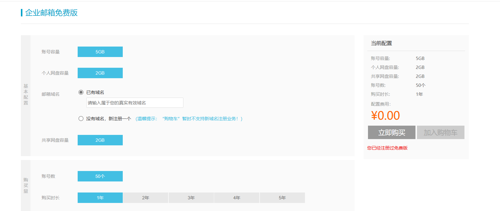
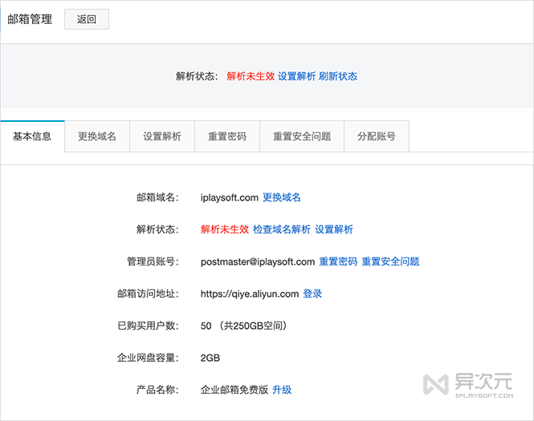
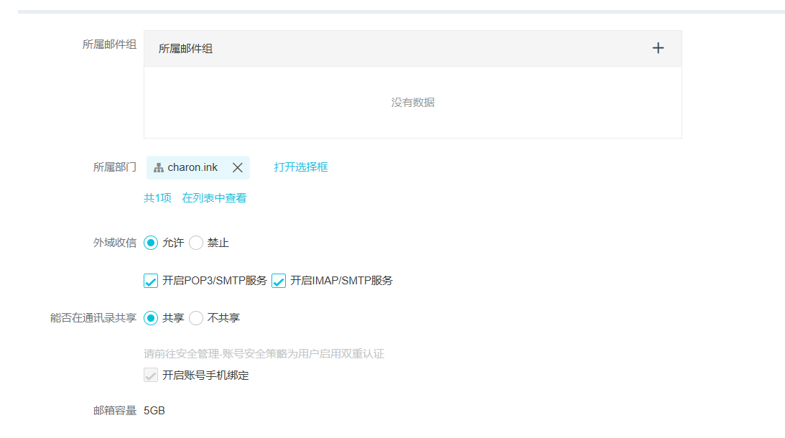

# 免费企业邮箱教程

当谈到**企业邮箱**（也称为**域名邮箱**）时，我们常常认为它是专为企业用户设计的。然而，实际上，它对个人用户也具有实用价值！其独特之处在于，它允许您将自己的邮箱与您自己拥有的域名绑定在一起。这不仅有助于提升个人品牌形象，还可以避免将邮箱绑定在特定服务提供商上（例如，从谷歌迁移出来的情况）。这使您的帐号可以长期保持，同时也增加了安全性。

需要注意的是，尽管阿里云官网已经隐藏了免费版入口，但目前仍然可以免费开通这项服务。

## 1.主流免费企业邮箱对比

当提到**免费的企业邮箱 / 域名邮箱**服务时，国内和国外都有多种选择。国内的主要选项包括[腾讯企业邮箱](https://www.iplaysoft.com/go/qqexmail)、[阿里云企业邮箱](https://www.iplaysoft.com/go/aliexmail)、163 网易企业邮箱、飞书企业邮箱、Zoho 中国版等，而国外有[微软 Office 365 企业邮箱](https://www.iplaysoft.com/go/ms365)、Zoho Mail 国际版、Yandex 等。

特别值得注意的是微软 Office 365 域名邮箱，虽然并非完全免费，但只要拥有 Microsoft 365 / Office 365 个人版或家庭版订阅，即可在 `outlook.com` 上绑定域名。考虑到许多人已经使用正版的办公软件，这实际上相当于免费使用企业邮箱。此外，微软在国内外都有出色的邮件收发成功率，对需要与国外合作伙伴进行沟通的外贸从业者来说可能是最简单且可靠的选择。

如果没有 Office 订阅，可以考虑注册申请其他免费的企业邮箱。这些邮箱各有各自的优缺点，例如腾讯企业邮箱强制要求开通企业微信，而 Zoho 不支持 IMAP 第三方客户端登录等。以下是一份对比表格，帮助更好地了解各个选项的特点。

| **服务商**       | **[阿里企业邮](https://www.iplaysoft.com/go/aliexmail)** | **[腾讯企业邮](https://exmail.qq.com/onlinesell/intro?utm_source=iplaysoft.com&hmsr=iplaysoft.com)** | **[飞书邮箱](https://www.feishu.cn/product/email?utm_source=iplaysoft.com&hmsr=iplaysoft.com)** | **[163网易](https://ym.163.com/?utm_source=iplaysoft.com&hmsr=iplaysoft.com)** | **[ZOHO 中国](https://www.zoho.com.cn/mail/?utm_source=iplaysoft.com&hmsr=iplaysoft.com)/[国际版](https://www.zoho.com/mail/?utm_source=iplaysoft.com&hmsr=iplaysoft.com)** |
| ---------------- | -------------------------------------------------------- | ------------------------------------------------------------ | ------------------------------------------------------------ | ------------------------------------------------------------ | ------------------------------------------------------------ |
| **服务器所在地** | 中国                                                     | 中国                                                         | 中国                                                         | 中国                                                         | 国内/海外                                                    |
| **用户数量**     | 50                                                       | 帐号数无上限 (绑定企业微信)                                  | 不限账号数 (绑定飞书)                                        | 50                                                           | 5                                                            |
| **邮箱空间**     | 5G/用户                                                  | 1G/用户                                                      | 共享 200G (认证可升级 500G)                                  | 3G/用户                                                      | 5G/用户                                                      |
| **附件大小**     | 60M                                                      | 50M                                                          | 默认 25M，使用飞书客户端支持最大 3G                          | 普通附件50M，不支持超大附件                                  | 25M                                                          |
| **企业网盘**     | 2G企业网盘                                               | 2G企业网盘                                                   | 无 / 但额外附带云文档等多种功能                              | 无                                                           | 无                                                           |
| **发信数量**     | 官方不公布                                               | 500封/天 (全部帐号)                                          | 200 收件人/日，认证可升至 500 (全部帐号)                     | 对外100封/天/帐号                                            | 未知                                                         |
| **第三方客户端** | 支持                                                     | 支持                                                         | 支持，但部分有限制                                           | 支持                                                         | 不支持，仅网页收发信                                         |
| **搬家服务**     | 提供                                                     | 提供                                                         | 提供                                                         | 提供                                                         | 未知                                                         |
| **邮件撤回**     | 支持                                                     | 支持                                                         | 支持                                                         | 不支持                                                       | 未知                                                         |

## 2.注册阿里云免费企业邮箱：

每个[阿里云账号](https://www.iplaysoft.com/go/aliyun)都可以免费开通一个免费版的企业邮箱，支持绑定一个域名，并且可以创建50个子邮箱。需要注意的是，管理员账号需要绑定手机，但其他所有子账号都不强制要求绑定手机，也不需要扫码或进行强制验证码登录，这一点相当便捷。

### 2.1注册帐号并开通免费企业邮箱：

+ 需要[注册一个阿里云帐号](https://www.iplaysoft.com/go/aliyun)，然后进行**个人实名认证或企业认证**。通常情况下，扫描支付宝二维码即可完成认证，非常简单。

+ 需要[注册一个域名](https://www.iplaysoft.com/go/domain)，如果已有域名则继续下一步。

+ 尽管阿里云提供免费企业邮箱，但官方网站上将免费版入口隐藏。直接访问[企业邮箱的官方网站](https://www.iplaysoft.com/go/aliexmail)只会显示付费套餐选项。可以点击[此链接](https://www.iplaysoft.com/go/alimailfree)进入免费版申请入口。

  

  + 其中购买时长可选 1~5 年，价格都是 0 元，到期会自动续费。

  + 完成购买即成功开通了免费企业邮箱。

> 管理员账号：postmaster@charon.ink为登录名
>
> 企业邮箱网址：https://qiye.aliyun.com/
>
> 企业邮箱控制台网址：[云邮箱控制台 (aliyun.com)](https://alimail.console.aliyun.com/?userCode=a5fdv0ky&regionId=cn-hangzhou#eyJ2YWx1ZSI6InByb2R1Y3RMaXN0In0=)

### 2.2设置域名解析 / 绑定域名：

1. 开通完成后，进入「[阿里云企业邮箱控制台](https://alimail.console.aliyun.com/?userCode=a5fdv0ky)」，会提示“MX 解析未生效”!

   

在「设置解析」一项里，可以看到阿里云邮箱需要设置的解析记录值，如下表所示：

| **主机记录值** | **解析类型** | **优先级** | **解析记录值**                        |
| -------------- | ------------ | ---------- | ------------------------------------- |
| @              | MX           | 5          | mxn.mxhichina.com                     |
| @              | MX           | 10         | mxw.mxhichina.com                     |
| mail           | CNAME        | -          | mail.mxhichina.com                    |
| @              | TXT          | -          | v=spf1 include:spf.mxhichina.com -all |

其中 `mail` 为可选项，如果域名备案了的话可以通过 `mail.xxx.com` (您的域名) 来访问邮箱网页版。

进入**您的域名所在的 DNS 解析服务后台**，设置好对应的值，等待大约 15 分钟之后，返回页面并点击“检查域名解析”。如果正确设置，域名绑定完成。

### 2.3 新建邮件帐号

- 进入「[阿里云企业邮箱控制台](https://alimail.console.aliyun.com/?userCode=a5fdv0ky)」，系统会生成一个名为 `[postmaster]你的域名` 的**管理员帐号**，在其旁边点击「初始化密码」或「重置密码」，设置一个新密码。
- 进入「[阿里云邮箱企业版](https://qiye.aliyun.com/?userCode=a5fdv0ky)」(以后访问你的邮箱均在此登录)，使用上面的管理员帐号登录。
- 在「员工账号管理」页面中可以根据自己的需要建立不同的邮箱帐号，新建时注意选择上“**开启POP3、IMAP/SMTP 服务**”；另外，嫌麻烦的同学则可以取消“开启帐号安全问题设置及手机绑定”以及“初次登录修改密码”选项：
  
- 建立好邮箱账号后就可以开始使用了！
- 你可以通过网页版收发邮件，也能使用第三方邮件客户端比如 [Outlook](https://www.iplaysoft.com/outlook-mobile.html)、[eM Client](https://www.iplaysoft.com/go/emclient)、[Foxmail](https://www.iplaysoft.com/foxmail.html) 等 APP 登录邮箱帐号。

### 2.4邮箱搬家 / 原邮箱数据迁移：

如果你希望将别的[邮箱](https://www.iplaysoft.com/tag/邮箱)数据迁移到阿里云来，可以登录邮箱管理员帐号，点击左侧的「邮箱工具→**邮箱搬家**」开启搬家服务。

- 实际上邮箱搬家服务是通过 IMAP 登录到原来的邮箱下载所有邮件来完成的。阿里云这里可以开启“员工自助搬家”，也能通过上传包含帐号密码的.csv文件进行多账号批量搬家。
- 你**原来的邮箱必须要先启用 IMAP 协议**，并且部分邮箱开启了[二步验证](https://www.iplaysoft.com/two-factor-authentication.html)的话，还需要去后台创建一个第三方应用专用密码 (而不是用原帐号密码) 才能登录。

根据实际测试，从原来的[Google](https://www.iplaysoft.com/tag/google)企业邮箱迁移时，创建专用密码后能够成功启动迁移过程。然而，迁移速度可能会非常慢，特别是如果您有大量的邮件和数据。由于Gmail的服务器位于海外，可能会导致迁移过程中的延迟和失败。在一些情况下，可能需要手动重启迁移并多次尝试，甚至可能需要连续迁移数天才能完成，这对用户体验来说并不理想。

相比之下，使用飞书邮箱进行迁移的速度更快，可能仅需短时间就能完成。这可能是因为不同邮箱提供商之间的迁移机制和服务器位置不同所导致的差异。对于用户来说，这种快速的迁移过程能够提供更好的体验，特别是在需要快速切换邮箱服务的情况下。

## 3.总结：

实际上，无论您是个人、团队还是公司，都有机会免费使用这些企业邮箱服务！您只需要注册一个域名即可。尽管免费版的容量和功能可能会受到一些限制，但对大多数人来说，它们通常已经足够满足需求。

各大免费企业邮箱的申请和设置方法大致相似，主要区别在于权益和功能。对于新手来说，主要要注意正确设置域名解析值。如果您尚未拥有自己的域名邮箱，不妨考虑今天就开始尝试免费注册一个，享受这项免费服务的好处吧！